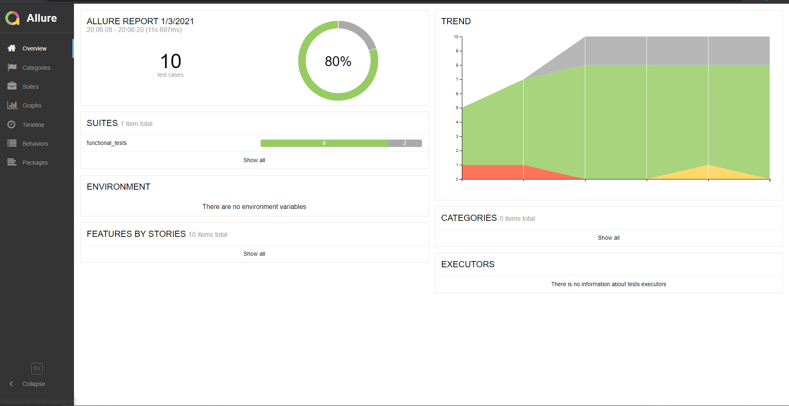
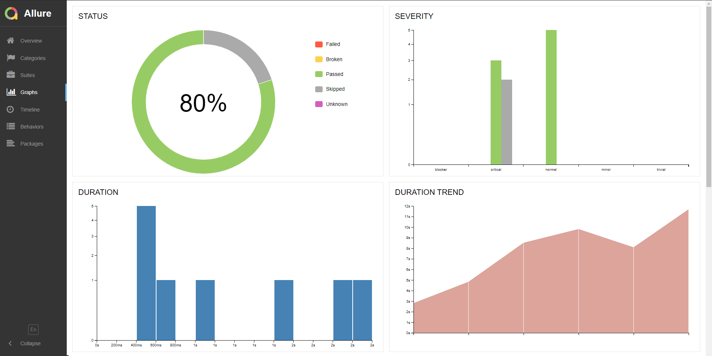

# README
This project enables REST endpoints to be tested for metaweather API. API documentation can be found [here](https://www.metaweather.com/api/)
The test framework includes test cases for ```LocationDay`` & ``LocationSearch`` API methods.

## Requirements
- Python 3.*.
- Pytest

## Setup
Create a [virtual environment](https://packaging.python.org/guides/installing-using-pip-and-virtual-environments), and install the required dependencies in ``requirements.txt`` 

```bash
pip install -r requirements.txt
```

## Technical Specifications
- Language          : Python
- Framework         : Pytest
- Reporting         : Allure-Reporting
- Data Provider     : Faker

## Implementation Includes
- Automated documentation
- Logging
- Reporting using Allure report
- Reading test data from JSON files
- Automated Data Generator

## To Run Tests
For a simple run of all the test files in normal mode, try the below command
```bash
pytest
```

To run the tests using [pytest markers](https://docs.pytest.org/en/stable/example/markers.html), try the below command
```bash
pytest -v -m LocationDay
```

*Available markers can be found in ``pytest.ini``*

## To Generate & Open Allure Reports
- To get the results for allure report, try the below command
    ```bash
    pytest --alluredir="/path/to/reportfolder"
    ```
- To generate the html allure report with the dashboards
    ```bash
    cd ${path where report folder is to be stored}
    allure generate "/path/to/reportfolder" --clean && allure open
    ```
- Allure Overview screenshots



- To get the trends on the dashboard, copy the history folder from previously generated allure reports folder to the allure directory(generated after pytest command).



### Project Structure

    - Root\
        - metaweather-api-test-automation\
            - data\
                - location_day\
                - location_search\
            - functional_tests\
                - conftest.py
                - test_location_day.py
                - test_location_search.py
                - ...
            - providers\
                - custom.py
                - ...
            - resources\
                - operations.py
                - ...
            - results\
                - logs\
                    - 202101031855.log
                - reports\
            - utilities\
                - custom_logger.py
                - read_json.py
                - setup.py
        - documentation\
            - metaweather-api-test-automation\
                - functional_tests\
                    - conftest.html
                    - test_location_day.html
                    - test_location_search.html
                - providers\
                    - custom.html
                - resources\
                    - operations.html
                - utilities\
                    - custom_logger.html
                    - index.html
                    - read_json.html
                    - setup.html

#### Data
- Data for input to the test cases is created using [faker](https://faker.readthedocs.io/en/master/providers/faker.providers.python.html) library and using custom providers techniques
- Data for verification i.e. expected result is captured in json files stored in ``data`` folder
##### Data Structure
    - data\
        - location_day\
            - 1062617.json
            - 2295412.json
            - 44418.json
            - 638242.json
        - location_search\
            - valid_lattlong_parameters.json
            - valid_query_parameter.json
            - valid_subset_query_parameter.json

#### What Could Be Done Differently
- Expected data managed in database (probably following a single table design)
- Integration with Jenkins
- Inclusion of End to End tests
- Inclusion of Performance tests
